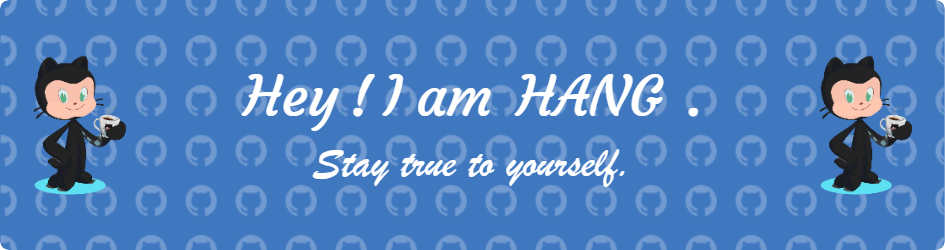

<!-- dynamic typing effect -->
<h1 align="center">
  
</h1>

<!-- c -->
<!-- snake -->
<picture>
  <source media="(prefers-color-scheme: dark)" srcset="https://raw.githubusercontent.com/qhangz/qhangz/output/github-contribution-grid-snake-dark.svg">
  <source media="(prefers-color-scheme: light)" srcset="https://raw.githubusercontent.com/qhangz/qhangz/output/github-contribution-grid-snake.svg">
  
</picture>

<!-- github streeak -->
<!-- 

  

 -->

<!-- knock code pictures -->
<!-- 

  
   

 -->

  
  

<!-- famous quotes -->
<!-- 

    

 -->

<!--  -->

<!--  -->

<!-- <h4 align="center">访客数 :eyes:</h4>

 -->

